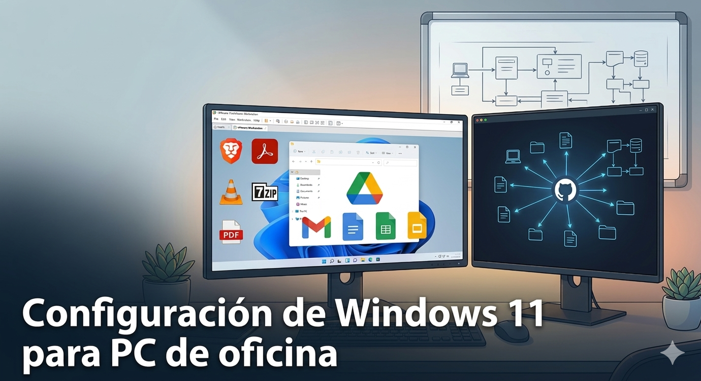

- **Nombre:** AndresTLM
- **Fecha:** 15/03/2026
- **Módulo:** Fundamentos de hardware
- **Centro:** Carlos III
- **Reto:** Configuración y Documentación PC de Oficina Completo
- **Unidad:** UT4 - RA2
- **GitHub:** [📎](https://github.com/andrestlm/Proyecto_RA2_UT4) https://github.com/andrestlm/Proyecto_RA2_UT4

---
## Índice
- **[Portada](./00-portada.md)**
  - *Portada e índice del proyecto*
* **[Fase 1: Entorno Virtual e Instalación de Windows](./01-entorno.md)**
  * *Detalles sobre el uso de VMware, asignación de hardware (10GB RAM, 2 Cores) y creación de los usuarios locales (admin y trabajador).*
* **[Fase 2: Software de Oficina y Justificaciones](./02-software.md)**
  * *Relación de programas instalados (Brave, Adobe Acrobat, 7-Zip, Google Drive, LibreOffice, VLC, Malwarebytes) y el motivo técnico de su elección.*
* **[Fase 3: Seguridad, Diagnóstico y Validación](./03-revision.md)**
  * *Configuración de Microsoft Defender, Windows Update y pruebas de funcionamiento (apertura de correos, compresión de archivos, lectura de PDFs, etc.).*
-  **[Fase 4: Repositorio](./docs/04-repositorio.md)**
  - *Ficheros extra inlcuidos en el repositorio*
- **[Entrega](./99-entrega.md)**
  - *Entrega única para exportarlo en PDF*