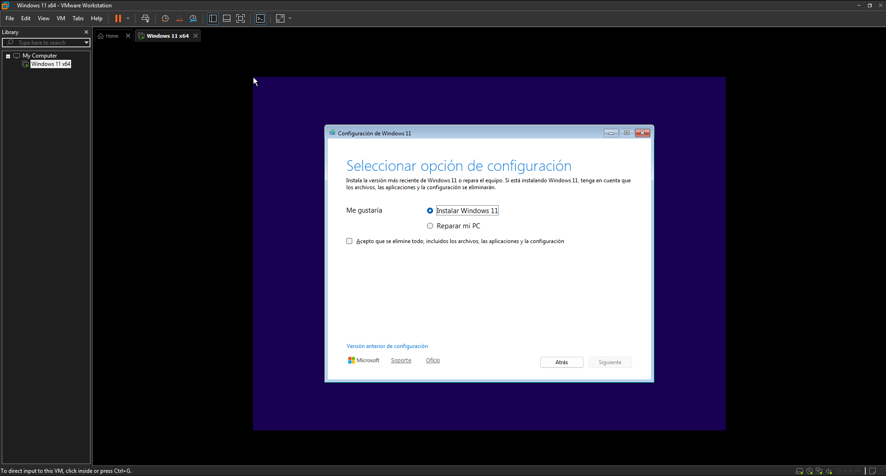
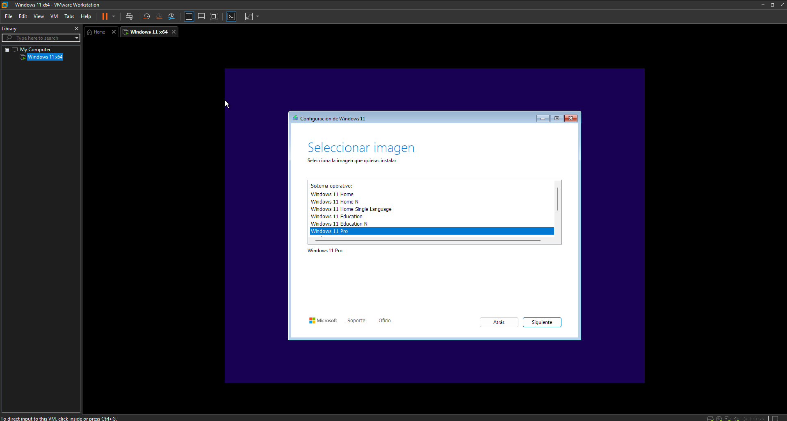
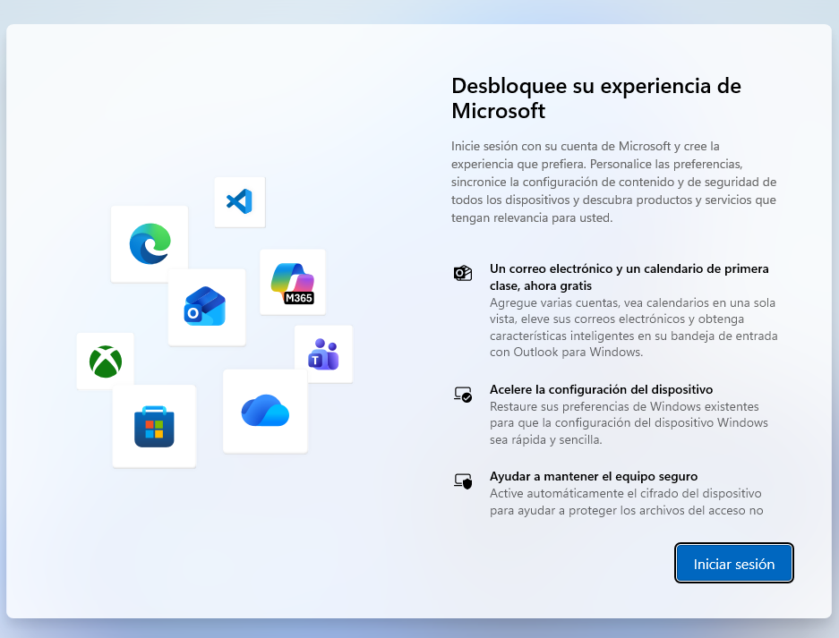
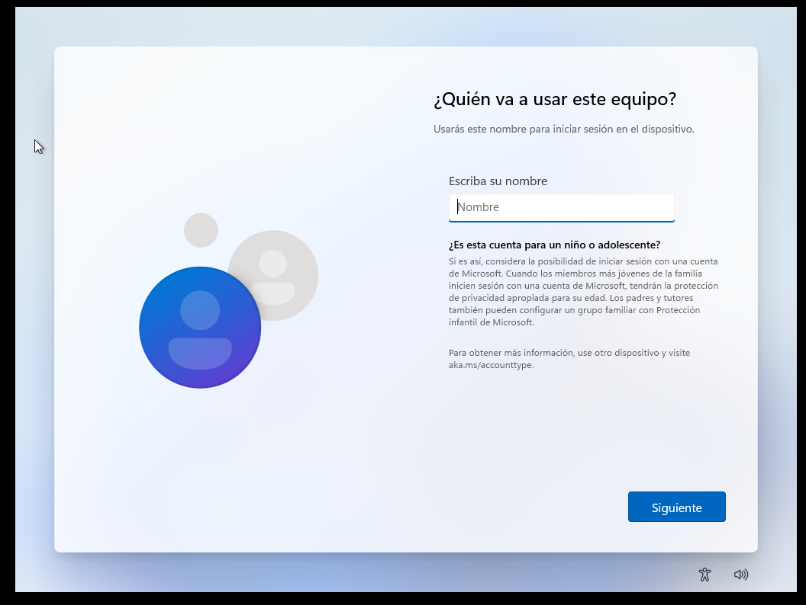
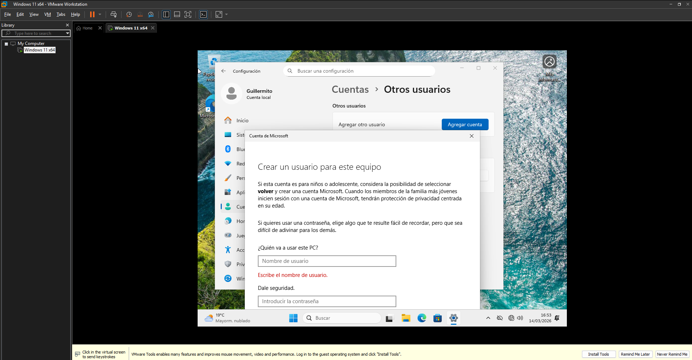
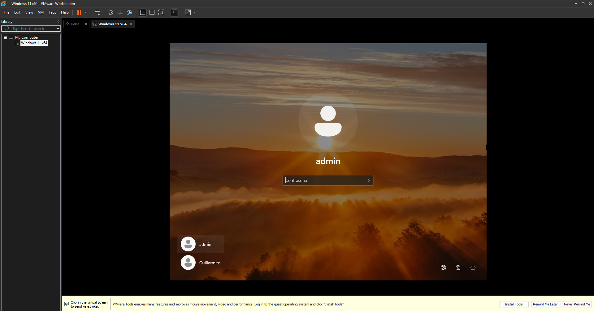

# EJERCICIO 1: Creación del entorno virtual e instalación de Windows

En esta parte configuraré la maquina virtual, poniéndole las especificaciones correspondiendo, instalando Windows y configurando las cuentas de usuario, locales en mi caso.

---
## 1. Maquina virtual
Para este reto usaré VMware Workstation 17.5
Me proporciona un buen rendimiento si estoy virtualizando Windows. VirtualBox por otro lado, en mi ordenador Windows con CPU AMD no va tan bien, generando mucha latencia en los click del ratón o funcionando muy lento.

---
## 2. Recursos máquina virtual
Para que pueda funcionar bien le he asignado esta cantidad de recursos:

* **Memoria RAM:** 10812 MB (10,6 GB)
    * Teniendo en cuenta que mi ordenador cuenta con 16GB, estos 10 GB (la cantidad ha sido resultado del "slider" de RAM, no buscaba una cantidad concreta) son los máximos que puedo ofrecerle a la maquina virtual sin que mi equipo empiece a funcionar peor. Por una parte positiva esta cantidad es un poco más del minimo, por tanto es una cantidad recomendada.
* **Procesador (CPU):** 2 Núcleos
    * Lo máximo que puedo ofrecer y lo minimo para un funcionamiento correcto.
* **Disco Duro Virtual:** 64GB (en un solo fichero)
    * Le he puesto el minimo que Windows 11 requiere, en caso de necesitar más, se le puede añadir. VMware da la opción de separar el almacenamiento en 1 archivo o en varios, elijo 1 porque es más rapido pero más dificil de pasar a otro PC.
* **Conexión de Red:** Adaptador en modo NAT
    * Se conecta de manera aislada y así viene por defecto.

---
## 3. Instalación de Windows
Se ha procedido a la instalación de Windows 11 Pro
He elegido la versión Pro ya que es la Profesional y la ideal para oficina, permitiendo integraciones en dominios con Active Directory y más opciones que la version Home no ofrece.
El proceso de instalación ha sido el siguiente:

#### Iniciar la máquina virtual
Primero que nada hay que hacer funcionar el Windows 11 que hemos preparado y empezar con la opcion de instalar dicho sistema operativo.

#### Elegir version Pro
Seleccionamos la opcion Windows 11 Pro por las razones especificadas anteriormente.

#### Preparar el disco
Particionamos el disco GPT como Windows lo hace por defecto. Si queremos añadir particiones extra, se puede hacer posteriormente en la configuración de discos.

#### Saltarse cuenta de Microsoft
Una vez se haya instalado Windows, hay que proceder con las configuraciones iniciales, que al estar en español con seguir por defecto está bien. Hasta que se llega a la configuración de usuario y al estar conectados a internet, despues de que se actualice todo, nos pide una cuenta. Como no quiero usar una cuenta hay que presionar `Shift + F10` y luego escribir `oobe\bypassnro`. El SO se reiniciará y tendremos que quitar la conexión por internet en los ajustes de la maquina virtual (despues se conectará otra vez después de la instalación).

#### Creación de usuario
Tras saltarse la cuenta de Microsoft, podremos crear un usuario local. Dicho usuario será el administrador, por tanto, se pondrá el nombre "admin". (Inicialmente puse el nombre de un usuario estándar ya que no tuve en cuenta que seria el administrador, pero en ese caso cambie el nombre despues de la configuración).

#### Finalización
Y con todo esto y denegar los permisos de localización, de diagnóstico, etc. podremos acceder a Windows.

---
## 4. Creación de Usuarios
Para mantener prácticas de seguridad de oficina, se crea un usuario para el administrador y otro para el trabajador/a. Así el PC no se operará desde una cuenta con permisos totales. Tras mi error en la configuración de la cuenta de usuario y cambiarle el nombre, y además de crear los usuarios localmente sin internet para que no me obligue a hacerlo con Microsoft, se han creado las dos cuentas:

1.  **Admin (Administrador):** Cuenta protegida con contraseña que nadie más sabe, que solo debe usarse para tareas de administración en el sistema operativo, como instalación de software y configuración del sistema.
2.  **Guillermito (Usuario normal):** Cuenta de trabajo sin privilegios, lo que bloquea a alguien que puede que no tenga conocimientos o que no deba cambiar nada. Dejando tareas más importantes para el usuario admin.

[⬅️ Volver a portada e índice](00-portada.md)