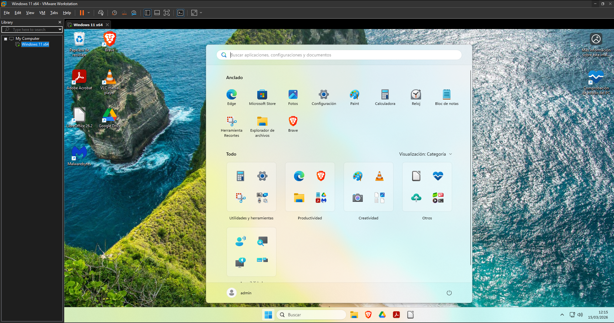
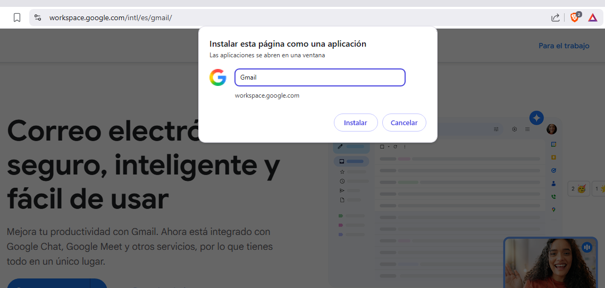

# EJERCICIO 2: Preparación del equipo para uso real en una oficina

En esta parte voy a dejar el equipo bien preparado para que el usuario pueda utilizarlo en su día a día sin problemas. He priorizado instalar software ligero, por las característica de mi máquina virtual, pero totalmente funcional.
Las instalaciones estan hechas desde el usuario "admin" para que luego el trabajador solo tenga que usar los programas sin que le salten avisos de permisos de administrador.

Muchos de estos programas se pueden descargar todos juntos fácilmente desde [Ninite](https://www.ninite.com).

---
## 1. Navegación web y entorno Google

Para acceder a internet y usar programas online me he decantado por **Brave**.

* **Nombre de la herramienta:** Brave Browser.
* **Función que cumple:** Navegador web principal y acceso a internet y herramientas online
* **Motivo por el que la has elegido:** Es un navegador gratuito que destaca por ser más privado que otros. Consume una cantidad de RAM normal y, aunque la empresa use principalmente el ecosistema de Google, no hay una razón obligatoria para usar Chrome. Brave está basado en Chromium, por lo que la compatibilidad con la suite de Google es total y perfecta.
* **Qué ventaja aporta para un ordenador de oficina:** Viene con un bloqueador de anuncios y rastreadores incluido por defecto. Esto evita distracciones visuales y acelera la carga de las páginas web. Tambien esto añade una capa extra de seguridad frente a publicidad engañosa que haga que el trabajador pueda caer en phishing durante la jornada laboral.
* **Evidencia fotográfica:** 

---
## 2. Gestión de documentos PDF

Para leer y firmar documentos he elegido **Adobe Acrobat Reader**.

* **Nombre de la herramienta:** Adobe Acrobat Reader (versión gratis).
* **Función que cumple:** es un lector de archivos PDF y herramienta para subrayar y firmar documentos.
* **Motivo por el que la has elegido:** es la opción de lector más común y conocida por los trabajadores, estando más acostumbrados a este lector que otros. Aunque sus funciones más avanzadas son de pago y para quien necesite estas funcionalidades, pues se usaría otro. Pero para un entorno de oficina tradicional es la mejor opción al ser la más estandarizada y conocida.
* **Qué ventaja aporta para un ordenador de oficina:** es un lector facil de usar, con una interfaz limpia y no tiene una curva de aprendizaje dificil para aprender a usar un lector. Firmar con, por ejemplo, certificado digital es fácil y gratis. Además, garantiza compatibilidad total con cualquier documento PDF externo que se reciba.
* **Evidencia fotográfica:** 
* Web oficial 

---
## 3. Compresión y descompresión de archivos

Para manejar archivos comprimidos he elegido **7-Zip**.

* **Nombre de la herramienta:** 7-Zip.
* **Función que cumple:** Comprimir archivos para enviarlos y descomprimir los que se reciben (en .zip, .rar, .7z, y más).
* **Motivo de la elección:** Es un software de código abierto, por tanto es 100% gratuito. WinRAR siempre acaba mostrando su ventananita de que la licencia ha caducado, y aunque se puede ignorar, puede que un trabajador que use el ordenador ocasionalmente, no lo sepa y piense que no lo puede usar.
* **Ventaja para la oficina:** Es ultra ligero, se integra en el menú contextual de Windows 11 y permite poner contraseñas cifradas a los archivos comprimidos.
* **Evidencia fotográfica:** 

---
## 4. Utilidades básicas para trabajo de oficina

Como suite informatica he usado en la nube uso **Google Drive para Escritorio**.

* **Nombre de la herramienta:** Google Drive for Desktop.
* **Función que cumple:** Sincronizar los archivos en la nube de drive directamente en el explorador de archivos de Windows por defecto.
* **Motivo de la elección:** Ya que es una oficina y no tenemos mucho almacenamiento fisico para los documentos, esta es la mejor manera de gestionar los archivos de la empresa de forma centralizada y con copias de seguridad automáticas, ya que estaríamos trabajando en la nube.
* **Ventaja para la oficina:** Al instalarlo, es como si fuese un disco duro más. El trabajador/a puede guardar o abrir archivos directamente desde el explorador de Windows, sin la acción de tener que abrir el navegador, buscar el directorio, y esperar a que se suba. En local está más integrado.
* **Evidencia fotográfica:** 

Como suite informática en local, uso **LibreOffice**.

* **Nombre de la herramienta:** LibreOffice.
* **Función que cumple:** Suite ofimática de escritorio.
* **Motivo de la elección:** Aunque la empresa trabaja principalmente con Google Docs/Sheets en la nube, es a considerar tener una alternativa local instalada. LibreOffice es un software de código abierto y gratuito, ahorrando el pago de la licencia de Word si no lo vamos a usar tanto.
* **Qué ventaja aporta para un ordenador de oficina:** Ofrece compatibilidad con los formatos de documentos típicos, como ".docx .xlsx .pptx". Si se quiere ver o editar uno de estos archivos en local, LibreOffice garantiza que pueda abrirlo y seguir trabajando sin problemas. O si por ejemplo, se prefiere ver el archivo en el ordenador sin tener que subirlo a Drive y verlo desde el navegador, además que puede no mostrarse en la vista previa de Drive.
* **Evidencia fotográfica:** 

Para la reproducción de archivos de audio y vídeo, he instalado **VLC Media Player**.

* **Nombre de la herramienta:** VLC Media Player.
* **Función que cumple:** Reproductor multimedia con mucho formatos compatibles.
* **Motivo de la elección:** El reproductor que trae Windows 11 por defecto puede dar problemas con algunos formato para ver ciertos archivos. VLC es gratuito, muy ligero y tiene los códecs instalados.
* **Qué ventaja aporta para un ordenador de oficina:** Dependiendo del trabajo, es común recibir vídeos, grabaciones de reuniones o instrucciones en vídeo en formatos ".mp4 .mkv .mov". Con VLC, confirmas que el trabajador pueda reproducir cualquier archivo multimedia que reciba, sin que tenga que pedir ayuda porque "el vídeo no se ve".
* **Evidencia fotográfica:** 

---
## 5. Configuración general de Windows

Por último, para que el ordenador resulte un poco más sencillo y limpio de software de terceros, he realizado unos ajustes finales en Windows 11 desde la cuenta de administrador:

* **Limpiar de bloatware:** Aunque mi Windows al haberse instalado sin internet, aun así contiene aplicaciones que no deseaba instalar por mi cuenta, por lo que he las he desinstalado, dejando solo las aplicaciones básicas por defecto. Así tambien ahorro espacio en el almacenamiento..
* **Aplicaciones predeterminadas:** He configurado Brave como navegador por defecto, Adobe Acrobat Reader como lector de PDF, 7zip para archivos comprimidos en lugar de que lo haga Windows y LibreOffice para que cuando se abra un documento.
* **Escritorio limpio:** He dejado el escritorio solo con la papelera y los programas instalados que suela usar, el resto estan cómodamente ordenados en el menú de inicio.
* **Barra de tareas simple:** A la barra de tareas la he dejado sin widgets y sin iconos que no use el trabajador para dejarla más sencilla.
* **Evidencia fotográfica:** 

- **PC Manager:** Para dejar el ordenador más limpio a lo largo del tiempo, este software permite gestionar el almacenamiento que usa, programas en desuso, programas que se inician junto al ordenador. En general sirve para hacer que el ordenador este más limpio y pueda seguir funcionando bien. Conveniente a instalar con una cuenta de Microsoft.
* **Evidencia fotográfica:** 

- **Ninite:** Fuente de descargas de varios de los programas utilizados.
* **Evidencia fotográfica:** 

---
## 6. Configurar Webs como aplicaciones

Es conveniente que todas las webs que accedemos mediante el navegador, sean guardadas en el escritorio y en el menú de inicio como "Aplicaciones".
- **Como hacerlo:** Simplemente en el menú de arriba a la derecha aparece "Guardar y compartir". Dentro de dicha opción nos aparecerá la posibilidad de instalarlo y ponerle un nombre personalizado.
- **Porque:** Con esta opción, el trabajador puede sencillamente usar esa web como una WebApp, como una manera más aislada de trabajar y concentrarse. Además, si el trabajador no suele usar ordenadores, ahorra los "clicks" que tiene que hacer para usar dicha web, como un proceso más intuitivo y guiado.
- **Problemas:** No todas las webs existentes tienen esta opción o es conveniente usar dicha web con está opción.
- **Evidencia fotográfica:** 
[⬅️ Volver a portada e índice](00-portada.md) 