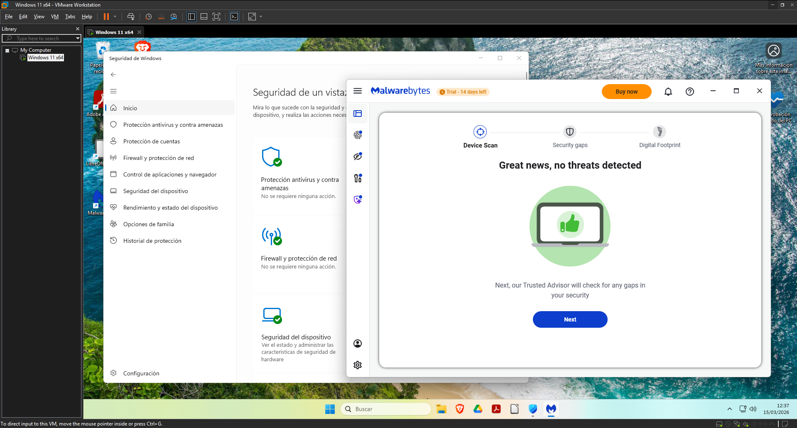
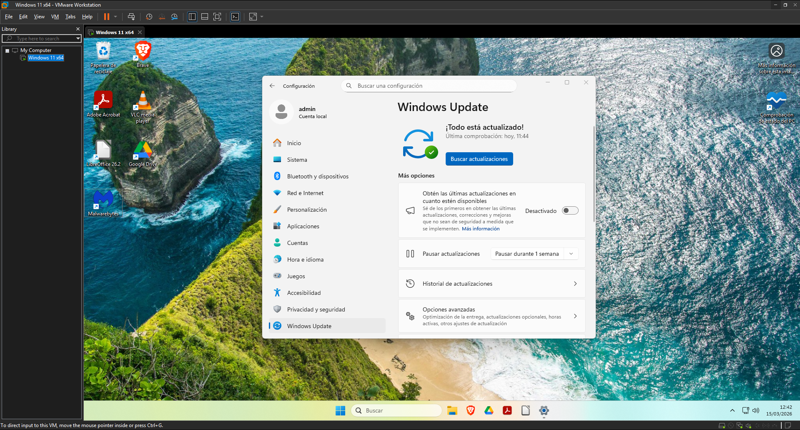
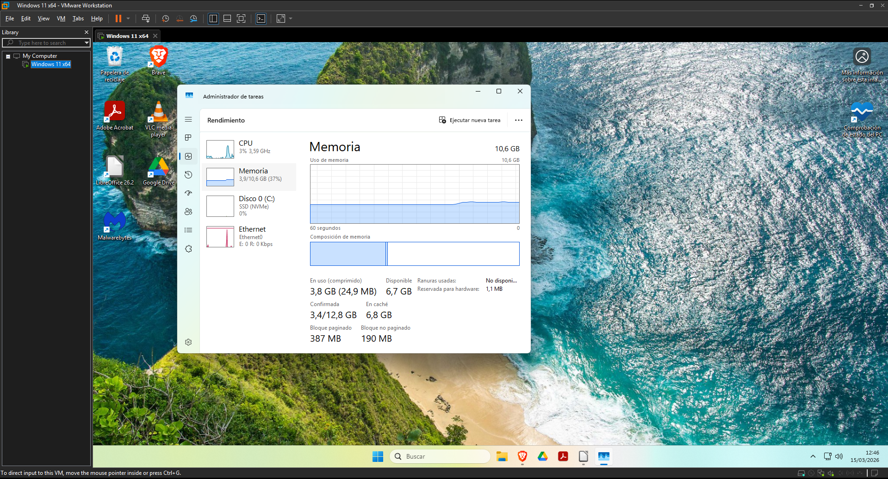
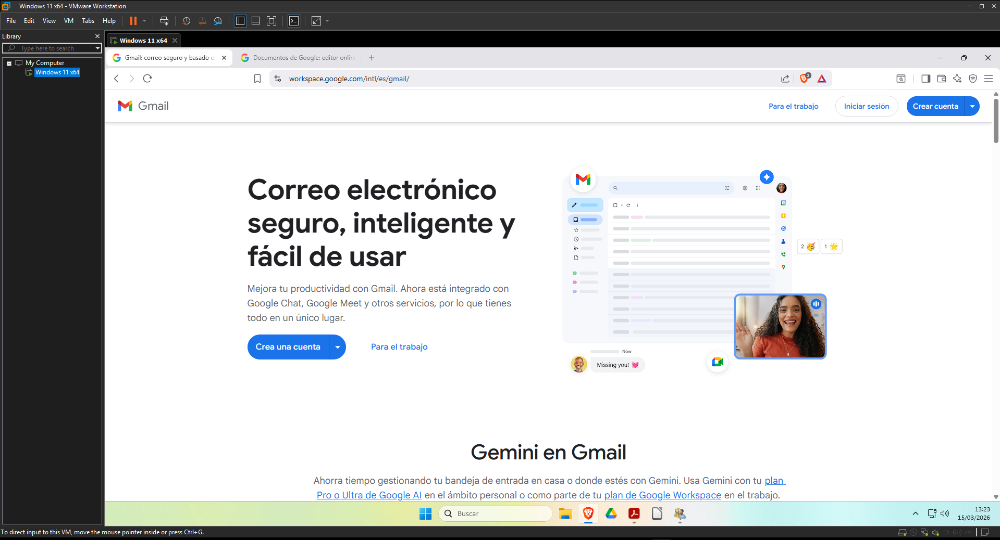
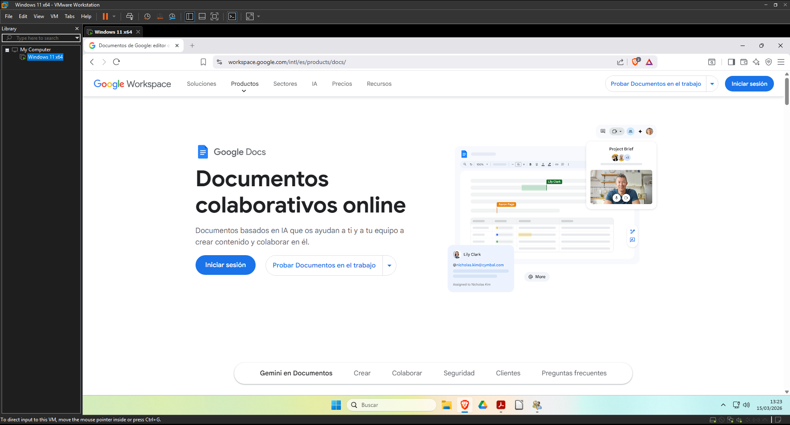
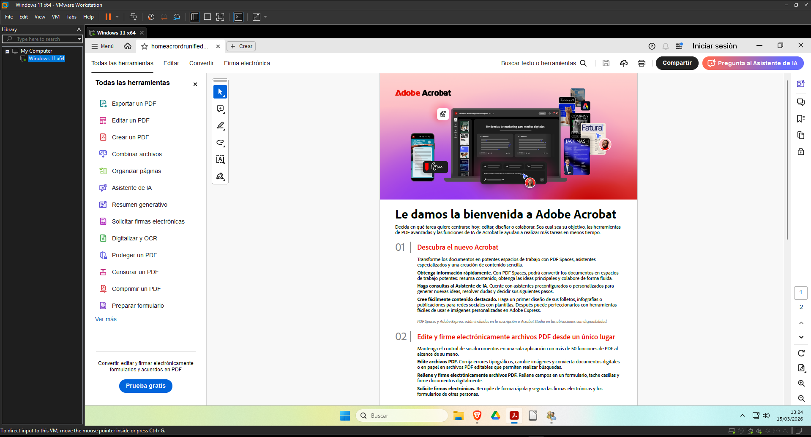
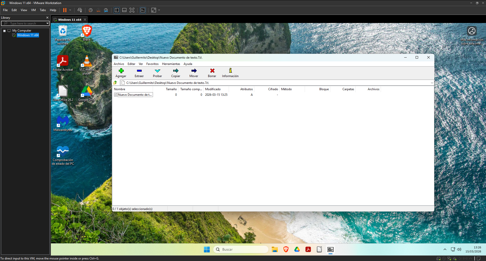
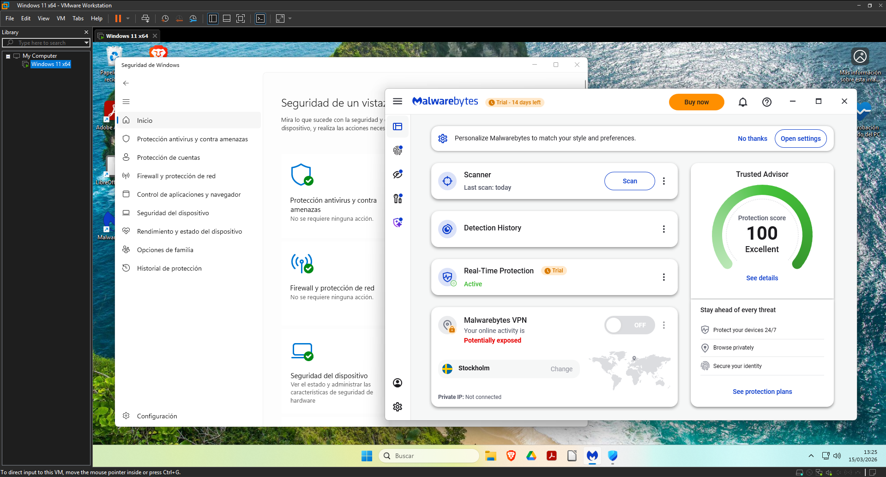
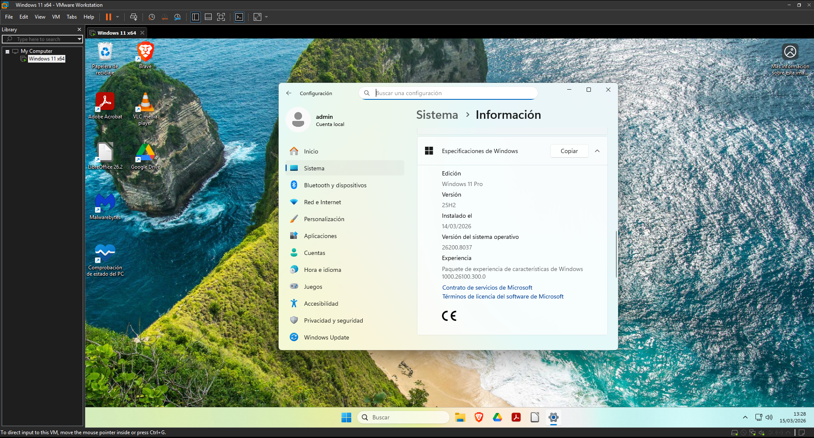
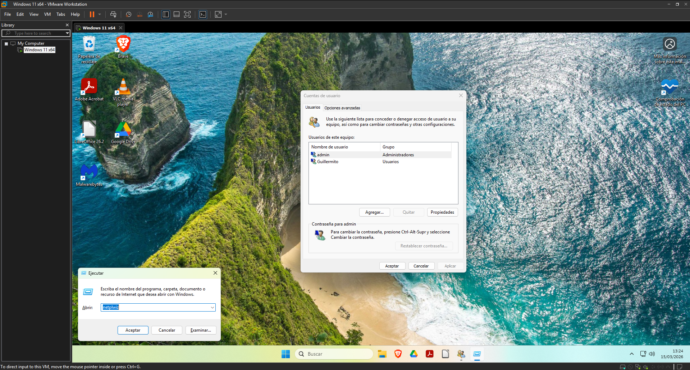

# EJERCICIO 3: Seguridad, mantenimiento, diagnóstico y validación final

Una vez instalado todo el software requerido para el uso del ordenador, el siguiente paso es asegurar el equipo, revisar que funcione bien y validar que el empleado pueda realizar sus tareas diarias sin errores. Todo este proceso se ha realizado desde la cuenta "admin".

---
## 1. Seguridad: Antivirus y análisis básico

* **Antivirus elegido:** Microsoft Defender y Malwarebytes.
* **Justificación técnica:** Ya que una protección en tiempo real de terceros consume bastante, y además que estos añadirían publicidad, ventanas emergentes y un consumo de recursos extra, se usa el Defender, que es el que viene por defecto. Es bastante estándar, pero para tener un pc seguro es igual de importante tener un navegador como Brave y tener cuidado con que se está descargando y no usar nada de fuentes desconocidas. Sin embargo, para una análisis de PC puntual, Malwarebytes es bastante reconocido y gratis.
* **Prueba realizada:** He hecho un análisis del sistema para verificar la seguridad de este.
* **Evidencia fotográfica:** 

---
## 2. Actualización del Sistema (Windows Update)

Para que un equipo este actualizado y seguro, hay que revisar las actualizaciones y actualizarlo cuando sea posible. 
* **Acción realizada:** He ido a Configuración --> Windows Update y he hecho las actualizaciones requeridas de sistema y de drivers.
* **Evidencia fotográfica:** 

---
## 3. Diagnóstico y monitorización del sistema

* **Herramienta utilizada:** Administrador de Tareas de Windows.
* **Justificación:** Es la herramienta más fiable para comprobar si la asignación de hardware es suficiente. Es mucho mejor que un software de terceros ya que puede consumir un poco más. Aquí tambien se puede comprobar que la velocidad de la RAM es la máxima que permite los slots.
* **Resultado:** Viendo el equipo con Brave y LibreOffice abiertos, la memoria RAM se mantiene en un uso estable, aunque no hay mucho más margen de uso.
* **Evidencia fotográfica:** 

---
## 4. Pruebas de funcionamiento

He comprobado que todas as herramientas para el día a día del trabajador/a funcionan:

1. **Acceso a Gmail:** Se ha abierto el navegador Brave y he visto que funciona perfectamente para entrar a la bandeja de entrada.
   * 
1. **Creación en Google Docs:** Se puede acceder a Google Docs de Drive en el navegador, pero tambien se puede con la aplicación de escritorio de Drive.
   * 
3. **Apertura de archivo PDF:** Se puede abrir y leer el documento de "bienvenida", y además este programa esta configurado para abrirse por defecto al abrir un PDF.
   * 
4. **Compresión y descompresión:** Se puede comprimir y descomprimir archivos en los formatos admitidos por 7zip, que son la mayoria.
   * 
5. **Comprobación antivirus:** Tanto la detección en tiempo real de Windows Defender y el propio programa de Malwarebytes funciona perfectamente. 
- 

---
## 5. Windows instalado

El sistema operativo Windows 11 está correctamente instalado, pero sin una clave.

- **Versión instalada:** Edición Windows 11 Pro Versión 25H2 26200.8037
- 

---
## 6. Registro de Incidencias

Durante el proceso de configuración y pruebas han surgido las siguientes incidencias, que han sido solventadas:

* **Incidencia 1: Requisito de Cuenta Microsoft en la instalación.** * 
* *Problema:* Windows 11 obliga a usar una cuenta de Microsoft, siendo un inconveniente para la gestión de cuentas y un requerimiento más que no hace falta.
* *Solución:* Abrir la consola con `Shift + F10`  e introducir `oobe\bypassnro` para reiniciar el sistema saltando este bloqueo y poder crear el usuario local. Mientras se reinicia, hay que desconectar el PC de internet.

* **Incidencia 2: Cambiar nombre de cuenta**
  * *Problema:* Al iniciar la configuración inicial, sin querer puse como nombre de la primera cuenta de usuario que se crea al trabajador, y tenía que poner al administrador, ya que esa cuenta que se crea tiene esos permisos
  * *Solución:* En el menú de ejecutar con `Win + R` iniciamos `netplwiz` y en las propiedades del usuario seleccionado se puede cambiar el nombre.
  * 

---
## 7. Conclusión

Con todo esto, el sistema está perfectamente configurado y demostrado que puede funcionar sin problema. Se le han hecho las pruebas necesarias para garantizar que el usuario del trabajador pueda hacer sus tareas diarias eficientemente. Tambien se ha comprobado el acceso al ecosistema de Google, la correcta apertura de archivos locales y la fluidez del sistema comprobando los recursos utilizados.

Además, la separación de cuentas por la del trabajador y del administrador, y sumado a la seguridad con Brave, Malwarebytes, Microsoft Defender y Windows Update, nos ofrecen un entorno de trabajo robusto, protegido y libre de bloatware.

Algunas mejoras que se pueden hacer a este sistema en un futuro pueden ser:
- **Copias de seguridad:** Ya que aunque los archivos de trabajo se sincronizan en Google Drive y se usan en nube, implementaría un software de backup para hacer imágenes de seguridad de todo el disco en un servidor controlado por la empresa.
- **Centralización con Active Directory:** Si la empresa contratase a más empleados, y más empleados usan este sistema, dejaría de usar cuentas locales y conectaría este Windows 11 Pro a un dominio de Windows Server. Esto permitiría gestionar las cuentas de una manera remota y centralizada.
[⬅️ Volver a portada e índice](00-portada.md)