# Portada

- **Nombre:** AndresTLM
- **Fecha:** 15/03/2026
- **Módulo:** Fundamentos de hardware
- **Centro:** Carlos III
- **Reto:** Configuración y Documentación PC de Oficina Completo
- **Unidad:** UT4 - RA2


---
## Índice

- **[Portada](./00-portada.md)**
  - *Portada e índice del proyecto*
* **[Fase 1: Entorno Virtual e Instalación de Windows](./01-entorno.md)**
  * *Detalles sobre el uso de VMware, asignación de hardware (10GB RAM, 2 Cores) y creación de los usuarios locales (admin y trabajador).*
* **[Fase 2: Software de Oficina y Justificaciones](./02-software.md)**
  * *Relación de programas instalados (Brave, Adobe Acrobat, 7-Zip, Google Drive, LibreOffice, VLC, Malwarebytes) y el motivo técnico de su elección.*
* **[Fase 3: Seguridad, Diagnóstico y Validación](./03-revision.md)**
  * *Configuración de Microsoft Defender, Windows Update y pruebas de funcionamiento (apertura de correos, compresión de archivos, lectura de PDFs, etc.).*
 * **[Fase 4: Repositorio](./04-repositorio.md)**
  * *Ficheros extra incluidos en el repositorio de GitHub*
- **[Entrega](./99-entrega.md)**
  - *Entrega única para exportarlo en PDF*

---
# 01-Entorno

# EJERCICIO 1: Creación del entorno virtual e instalación de Windows

En esta parte configuraré la maquina virtual, poniéndole las especificaciones correspondiendo, instalando Windows y configurando las cuentas de usuario, locales en mi caso.

---
## 1. Maquina virtual
Para este reto usaré VMware Workstation 17.5
Me proporciona un buen rendimiento si estoy virtualizando Windows. VirtualBox por otro lado, en mi ordenador Windows con CPU AMD no va tan bien, generando mucha latencia en los click del ratón o funcionando muy lento.

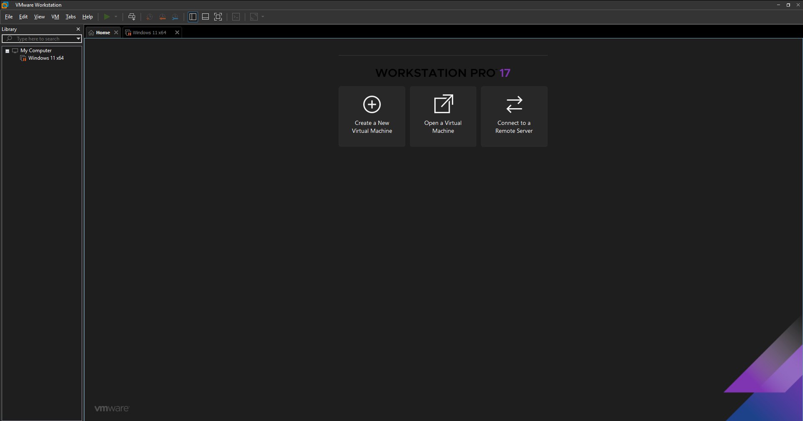

---
## 2. Recursos máquina virtual
Para que pueda funcionar bien le he asignado esta cantidad de recursos:

* **Memoria RAM:** 10812 MB (10,6 GB)
    * Teniendo en cuenta que mi ordenador cuenta con 16GB, estos 10 GB (la cantidad ha sido resultado del "slider" de RAM, no buscaba una cantidad concreta) son los máximos que puedo ofrecerle a la maquina virtual sin que mi equipo empiece a funcionar peor. Por una parte positiva esta cantidad es un poco más del minimo, por tanto es una cantidad recomendada.
* **Procesador (CPU):** 2 Núcleos
    * Lo máximo que puedo ofrecer y lo minimo para un funcionamiento correcto.
* **Disco Duro Virtual:** 64GB (en un solo fichero)
    * Le he puesto el minimo que Windows 11 requiere, en caso de necesitar más, se le puede añadir. VMware da la opción de separar el almacenamiento en 1 archivo o en varios, elijo 1 porque es más rapido pero más dificil de pasar a otro PC.
* **Conexión de Red:** Adaptador en modo NAT
    * Se conecta de manera aislada y así viene por defecto.

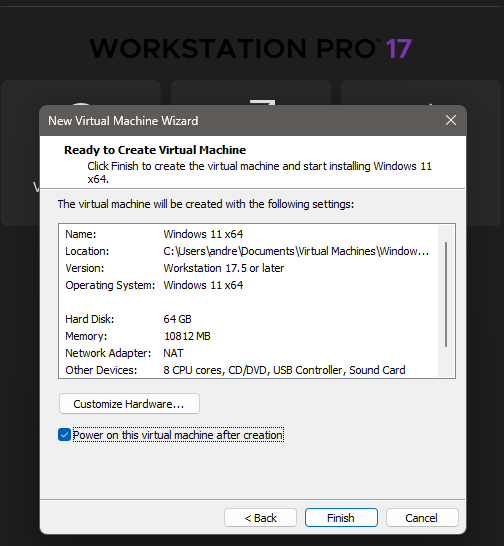

---
## 3. Instalación de Windows
Se ha procedido a la instalación de Windows 11 Pro
He elegido la versión Pro ya que es la Profesional y la ideal para oficina, permitiendo integraciones en dominios con Active Directory y más opciones que la version Home no ofrece.
El proceso de instalación ha sido el siguiente:

#### Iniciar la máquina virtual
Primero que nada hay que hacer funcionar el Windows 11 que hemos preparado y empezar con la opcion de instalar dicho sistema operativo.


#### Elegir version Pro
Seleccionamos la opcion Windows 11 Pro por las razones especificadas anteriormente.


#### Preparar el disco
Particionamos el disco GPT como Windows lo hace por defecto. Si queremos añadir particiones extra, se puede hacer posteriormente en la configuración de discos.
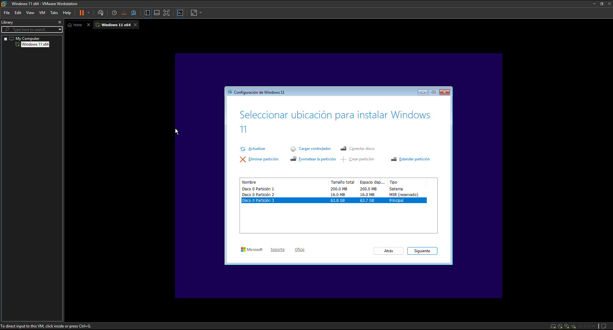

#### Saltarse cuenta de Microsoft
Una vez se haya instalado Windows, hay que proceder con las configuraciones iniciales, que al estar en español con seguir por defecto está bien. Hasta que se llega a la configuración de usuario y al estar conectados a internet, despues de que se actualice todo, nos pide una cuenta. Como no quiero usar una cuenta hay que presionar `Shift + F10` y luego escribir `oobe\bypassnro`. El SO se reiniciará y tendremos que quitar la conexión por internet en los ajustes de la maquina virtual (despues se conectará otra vez después de la instalación).


#### Creación de usuario
Tras saltarse la cuenta de Microsoft, podremos crear un usuario local. Dicho usuario será el administrador, por tanto, se pondrá el nombre "admin". (Inicialmente puse el nombre de un usuario estándar ya que no tuve en cuenta que seria el administrador, pero en ese caso cambie el nombre despues de la configuración).


#### Finalización
Y con todo esto y denegar los permisos de localización, de diagnóstico, etc. podremos acceder a Windows.
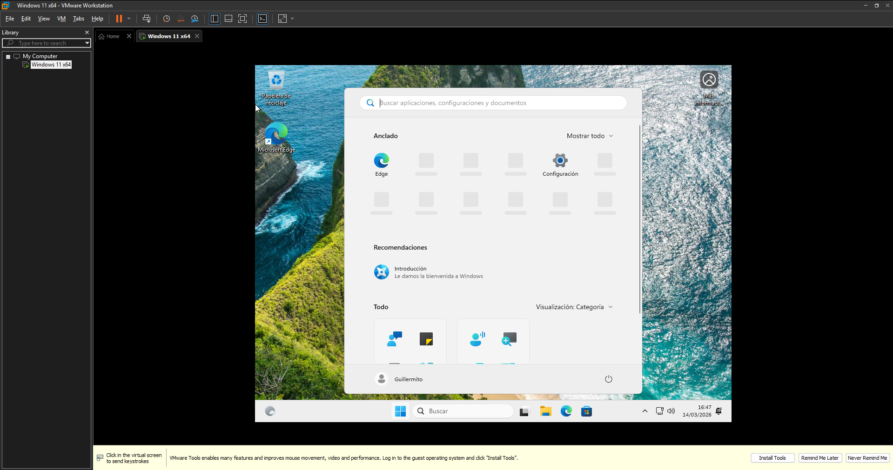

---
## 4. Creación de Usuarios
Para mantener prácticas de seguridad de oficina, se crea un usuario para el administrador y otro para el trabajador/a. Así el PC no se operará desde una cuenta con permisos totales. Tras mi error en la configuración de la cuenta de usuario y cambiarle el nombre, y además de crear los usuarios localmente sin internet para que no me obligue a hacerlo con Microsoft, se han creado las dos cuentas:

1.  **Admin (Administrador):** Cuenta protegida con contraseña que nadie más sabe, que solo debe usarse para tareas de administración en el sistema operativo, como instalación de software y configuración del sistema.
2.  **Guillermito (Usuario normal):** Cuenta de trabajo sin privilegios, lo que bloquea a alguien que puede que no tenga conocimientos o que no deba cambiar nada. Dejando tareas más importantes para el usuario admin.


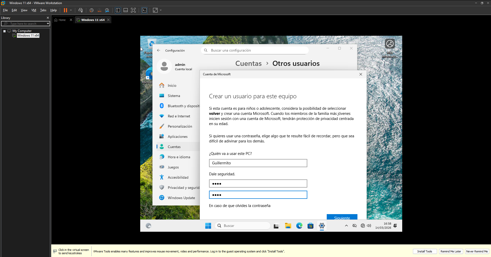

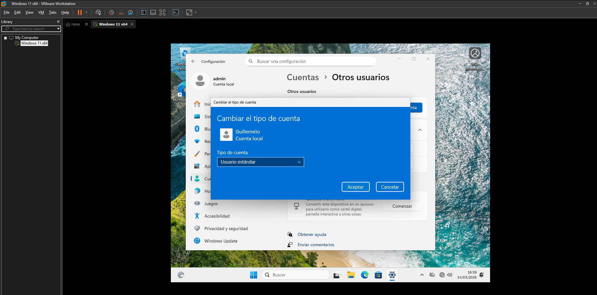


[⬅️ Volver a portada e índice](00-portada.md)

---
# 02-Software

# EJERCICIO 2: Preparación del equipo para uso real en una oficina

En esta parte voy a dejar el equipo bien preparado para que el usuario pueda utilizarlo en su día a día sin problemas. He priorizado instalar software ligero, por las característica de mi máquina virtual, pero totalmente funcional.
Las instalaciones estan hechas desde el usuario "admin" para que luego el trabajador solo tenga que usar los programas sin que le salten avisos de permisos de administrador.

Muchos de estos programas se pueden descargar todos juntos fácilmente desde [Ninite](https://www.ninite.com).

---
## 1. Navegación web y entorno Google

Para acceder a internet y usar programas online me he decantado por **Brave**.

* **Nombre de la herramienta:** Brave Browser.
* **Función que cumple:** Navegador web principal y acceso a internet y herramientas online
* **Motivo por el que la has elegido:** Es un navegador gratuito que destaca por ser más privado que otros. Consume una cantidad de RAM normal y, aunque la empresa use principalmente el ecosistema de Google, no hay una razón obligatoria para usar Chrome. Brave está basado en Chromium, por lo que la compatibilidad con la suite de Google es total y perfecta.
* **Qué ventaja aporta para un ordenador de oficina:** Viene con un bloqueador de anuncios y rastreadores incluido por defecto. Esto evita distracciones visuales y acelera la carga de las páginas web. Tambien esto añade una capa extra de seguridad frente a publicidad engañosa que haga que el trabajador pueda caer en phishing durante la jornada laboral.
* **Evidencia fotográfica:** 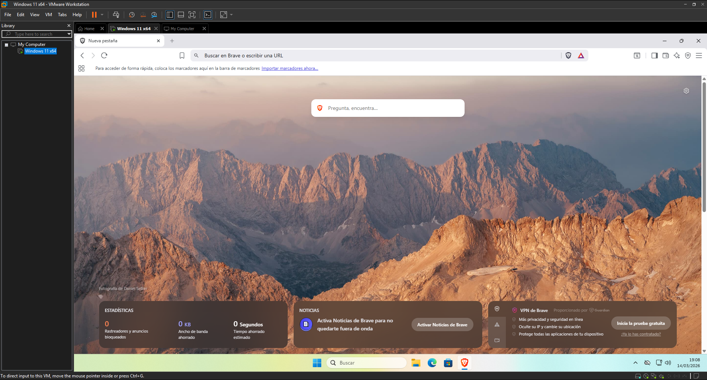

---
## 2. Gestión de documentos PDF

Para leer y firmar documentos he elegido **Adobe Acrobat Reader**.

* **Nombre de la herramienta:** Adobe Acrobat Reader (versión gratis).
* **Función que cumple:** es un lector de archivos PDF y herramienta para subrayar y firmar documentos.
* **Motivo por el que la has elegido:** es la opción de lector más común y conocida por los trabajadores, estando más acostumbrados a este lector que otros. Aunque sus funciones más avanzadas son de pago y para quien necesite estas funcionalidades, pues se usaría otro. Pero para un entorno de oficina tradicional es la mejor opción al ser la más estandarizada y conocida.
* **Qué ventaja aporta para un ordenador de oficina:** es un lector facil de usar, con una interfaz limpia y no tiene una curva de aprendizaje dificil para aprender a usar un lector. Firmar con, por ejemplo, certificado digital es fácil y gratis. Además, garantiza compatibilidad total con cualquier documento PDF externo que se reciba.
* **Evidencia fotográfica:** 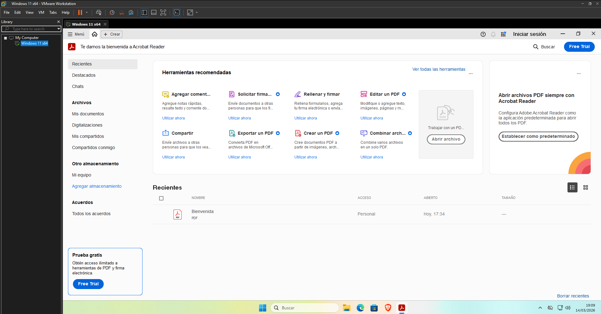
* Web oficial 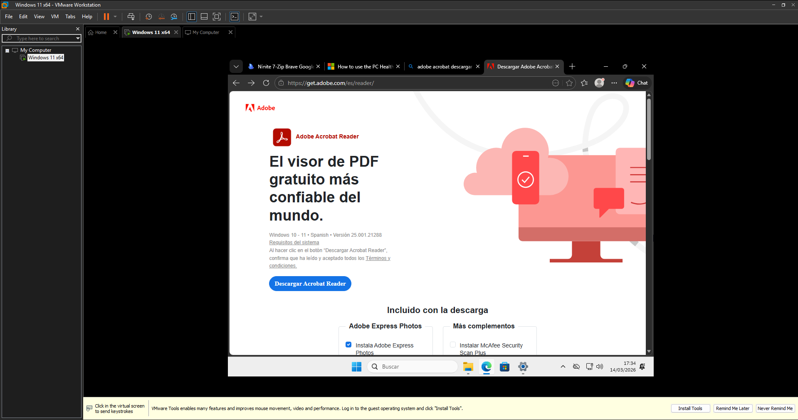

---
## 3. Compresión y descompresión de archivos

Para manejar archivos comprimidos he elegido **7-Zip**.

* **Nombre de la herramienta:** 7-Zip.
* **Función que cumple:** Comprimir archivos para enviarlos y descomprimir los que se reciben (en .zip, .rar, .7z, y más).
* **Motivo de la elección:** Es un software de código abierto, por tanto es 100% gratuito. WinRAR siempre acaba mostrando su ventananita de que la licencia ha caducado, y aunque se puede ignorar, puede que un trabajador que use el ordenador ocasionalmente, no lo sepa y piense que no lo puede usar.
* **Ventaja para la oficina:** Es ultra ligero, se integra en el menú contextual de Windows 11 y permite poner contraseñas cifradas a los archivos comprimidos.
* **Evidencia fotográfica:** 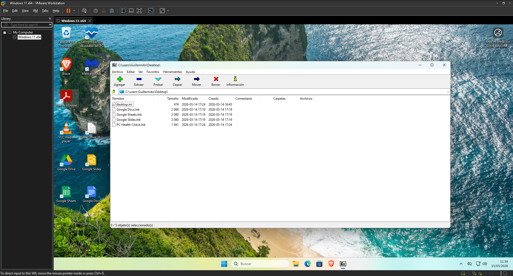

---
## 4. Utilidades básicas para trabajo de oficina

Como suite informatica he usado en la nube uso **Google Drive para Escritorio**.

* **Nombre de la herramienta:** Google Drive for Desktop.
* **Función que cumple:** Sincronizar los archivos en la nube de drive directamente en el explorador de archivos de Windows por defecto.
* **Motivo de la elección:** Ya que es una oficina y no tenemos mucho almacenamiento fisico para los documentos, esta es la mejor manera de gestionar los archivos de la empresa de forma centralizada y con copias de seguridad automáticas, ya que estaríamos trabajando en la nube.
* **Ventaja para la oficina:** Al instalarlo, es como si fuese un disco duro más. El trabajador/a puede guardar o abrir archivos directamente desde el explorador de Windows, sin la acción de tener que abrir el navegador, buscar el directorio, y esperar a que se suba. En local está más integrado.
* **Evidencia fotográfica:** 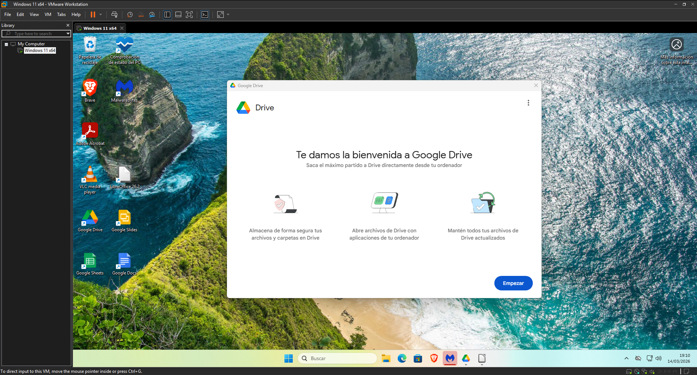

Como suite informática en local, uso **LibreOffice**.

* **Nombre de la herramienta:** LibreOffice.
* **Función que cumple:** Suite ofimática de escritorio.
* **Motivo de la elección:** Aunque la empresa trabaja principalmente con Google Docs/Sheets en la nube, es a considerar tener una alternativa local instalada. LibreOffice es un software de código abierto y gratuito, ahorrando el pago de la licencia de Word si no lo vamos a usar tanto.
* **Qué ventaja aporta para un ordenador de oficina:** Ofrece compatibilidad con los formatos de documentos típicos, como ".docx .xlsx .pptx". Si se quiere ver o editar uno de estos archivos en local, LibreOffice garantiza que pueda abrirlo y seguir trabajando sin problemas. O si por ejemplo, se prefiere ver el archivo en el ordenador sin tener que subirlo a Drive y verlo desde el navegador, además que puede no mostrarse en la vista previa de Drive.
* **Evidencia fotográfica:** 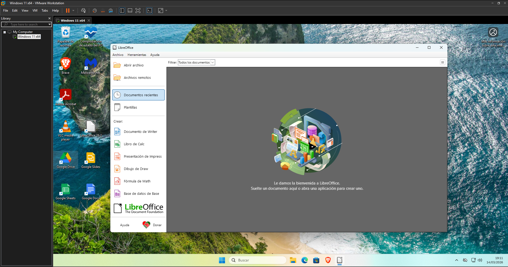

Para la reproducción de archivos de audio y vídeo, he instalado **VLC Media Player**.

* **Nombre de la herramienta:** VLC Media Player.
* **Función que cumple:** Reproductor multimedia con mucho formatos compatibles.
* **Motivo de la elección:** El reproductor que trae Windows 11 por defecto puede dar problemas con algunos formato para ver ciertos archivos. VLC es gratuito, muy ligero y tiene los códecs instalados.
* **Qué ventaja aporta para un ordenador de oficina:** Dependiendo del trabajo, es común recibir vídeos, grabaciones de reuniones o instrucciones en vídeo en formatos ".mp4 .mkv .mov". Con VLC, confirmas que el trabajador pueda reproducir cualquier archivo multimedia que reciba, sin que tenga que pedir ayuda porque "el vídeo no se ve".
* **Evidencia fotográfica:** 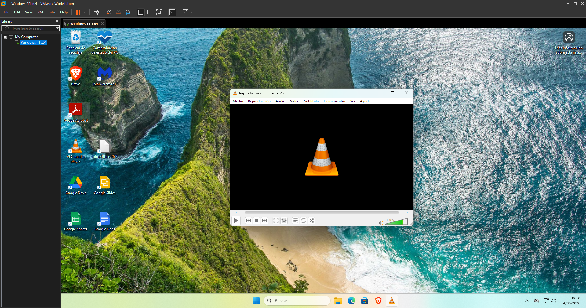

---
## 5. Configuración general de Windows

Por último, para que el ordenador resulte un poco más sencillo y limpio de software de terceros, he realizado unos ajustes finales en Windows 11 desde la cuenta de administrador:

* **Limpiar de bloatware:** Aunque mi Windows al haberse instalado sin internet, aun así contiene aplicaciones que no deseaba instalar por mi cuenta, por lo que he las he desinstalado, dejando solo las aplicaciones básicas por defecto. Así tambien ahorro espacio en el almacenamiento..
* **Aplicaciones predeterminadas:** He configurado Brave como navegador por defecto, Adobe Acrobat Reader como lector de PDF, 7zip para archivos comprimidos en lugar de que lo haga Windows y LibreOffice para que cuando se abra un documento.
* **Escritorio limpio:** He dejado el escritorio solo con la papelera y los programas instalados que suela usar, el resto estan cómodamente ordenados en el menú de inicio.
* **Barra de tareas simple:** A la barra de tareas la he dejado sin widgets y sin iconos que no use el trabajador para dejarla más sencilla.
* **Evidencia fotográfica:** 

- **PC Manager:** Para dejar el ordenador más limpio a lo largo del tiempo, este software permite gestionar el almacenamiento que usa, programas en desuso, programas que se inician junto al ordenador. En general sirve para hacer que el ordenador este más limpio y pueda seguir funcionando bien. Conveniente a instalar con una cuenta de Microsoft.
* **Evidencia fotográfica:** 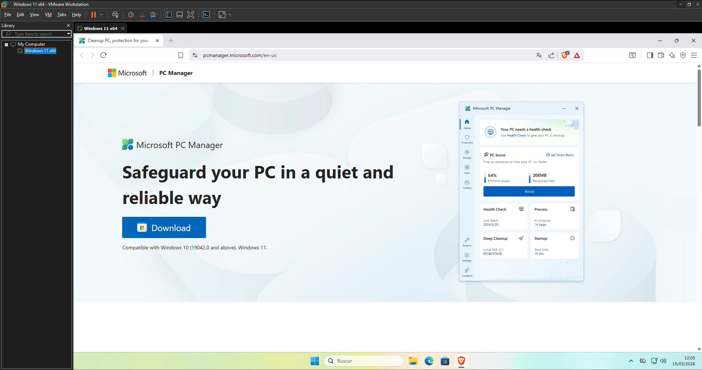

- **Ninite:** Fuente de descargas de varios de los programas utilizados.
* **Evidencia fotográfica:** 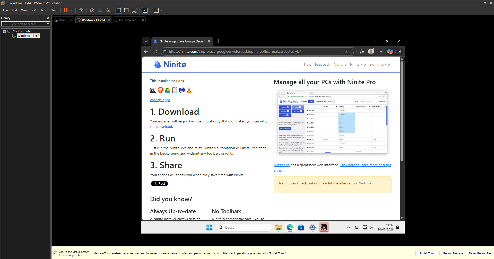
[⬅️ Volver a portada e índice](00-portada.md)

---
# 03-Revisión

# EJERCICIO 3: Seguridad, mantenimiento, diagnóstico y validación final

Una vez instalado todo el software requerido para el uso del ordenador, el siguiente paso es asegurar el equipo, revisar que funcione bien y validar que el empleado pueda realizar sus tareas diarias sin errores. Todo este proceso se ha realizado desde la cuenta "admin".

---
## 1. Seguridad: Antivirus y análisis básico

* **Antivirus elegido:** Microsoft Defender y Malwarebytes.
* **Justificación técnica:** Ya que una protección en tiempo real de terceros consume bastante, y además que estos añadirían publicidad, ventanas emergentes y un consumo de recursos extra, se usa el Defender, que es el que viene por defecto. Es bastante estándar, pero para tener un pc seguro es igual de importante tener un navegador como Brave y tener cuidado con que se está descargando y no usar nada de fuentes desconocidas. Sin embargo, para una análisis de PC puntual, Malwarebytes es bastante reconocido y gratis.
* **Prueba realizada:** He hecho un análisis del sistema para verificar la seguridad de este.
* **Evidencia fotográfica:** 

---
## 2. Actualización del Sistema (Windows Update)

Para que un equipo este actualizado y seguro, hay que revisar las actualizaciones y actualizarlo cuando sea posible. 
* **Acción realizada:** He ido a Configuración --> Windows Update y he hecho las actualizaciones requeridas de sistema y de drivers.
* **Evidencia fotográfica:** 

---
## 3. Diagnóstico y monitorización del sistema

* **Herramienta utilizada:** Administrador de Tareas de Windows.
* **Justificación:** Es la herramienta más fiable para comprobar si la asignación de hardware es suficiente. Es mucho mejor que un software de terceros ya que puede consumir un poco más. Aquí tambien se puede comprobar que la velocidad de la RAM es la máxima que permite los slots.
* **Resultado:** Viendo el equipo con Brave y LibreOffice abiertos, la memoria RAM se mantiene en un uso estable, aunque no hay mucho más margen de uso.
* **Evidencia fotográfica:** 

---
## 4. Pruebas de funcionamiento

He comprobado que todas as herramientas para el día a día del trabajador/a funcionan:

1. **Acceso a Gmail:** Se ha abierto el navegador Brave y he visto que funciona perfectamente para entrar a la bandeja de entrada.
   * 
2. **Creación en Google Docs:** Se puede acceder a Google Docs de Drive en el navegador, pero tambien se puede con la aplicación de escritorio de Drive.
   * 
3. **Apertura de archivo PDF:** Se puede abrir y leer el documento de "bienvenida", y además este programa esta configurado para abrirse por defecto al abrir un PDF.
   * 
4. **Compresión y descompresión:** Se puede comprimir y descomprimir archivos en los formatos admitidos por 7zip, que son la mayoria.
   * 
5. **Comprobación antivirus:** Tanto la detección en tiempo real de Windows Defender y el propio programa de Malwarebytes funciona perfectamente. 
- 

---
## 5. Windows instalado

El sistema operativo Windows 11 está correctamente instalado, pero sin una clave.

- **Versión instalada:** Edición Windows 11 Pro Versión 25H2 26200.8037
- 

---
## 6. Registro de Incidencias

Durante el proceso de configuración y pruebas han surgido las siguientes incidencias, que han sido solventadas:

* **Incidencia 1: Requisito de Cuenta Microsoft en la instalación.** * 
* *Problema:* Windows 11 obliga a usar una cuenta de Microsoft, siendo un inconveniente para la gestión de cuentas y un requerimiento más que no hace falta.
* *Solución:* Abrir la consola con `Shift + F10`  e introducir `oobe\bypassnro` para reiniciar el sistema saltando este bloqueo y poder crear el usuario local. Mientras se reinicia, hay que desconectar el PC de internet.

* **Incidencia 2: Cambiar nombre de cuenta**
  * *Problema:* Al iniciar la configuración inicial, sin querer puse como nombre de la primera cuenta de usuario que se crea al trabajador, y tenía que poner al administrador, ya que esa cuenta que se crea tiene esos permisos
  * *Solución:* En el menú de ejecutar con `Win + R` iniciamos `netplwiz` y en las propiedades del usuario seleccionado se puede cambiar el nombre.
  * 

---
## 7. Conclusión

Con todo esto, el sistema está perfectamente configurado y demostrado que puede funcionar sin problema. Se le han hecho las pruebas necesarias para garantizar que el usuario del trabajador pueda hacer sus tareas diarias eficientemente. Tambien se ha comprobado el acceso al ecosistema de Google, la correcta apertura de archivos locales y la fluidez del sistema comprobando los recursos utilizados.

Además, la separación de cuentas por la del trabajador y del administrador, y sumado a la seguridad con Brave, Malwarebytes, Microsoft Defender y Windows Update, nos ofrecen un entorno de trabajo robusto, protegido y libre de bloatware.

Algunas mejoras que se pueden hacer a este sistema en un futuro pueden ser:
- **Copias de seguridad:** Ya que aunque los archivos de trabajo se sincronizan en Google Drive y se usan en nube, implementaría un software de backup para hacer imágenes de seguridad de todo el disco en un servidor controlado por la empresa.
- **Centralización con Active Directory:** Si la empresa contratase a más empleados, y más empleados usan este sistema, dejaría de usar cuentas locales y conectaría este Windows 11 Pro a un dominio de Windows Server. Esto permitiría gestionar las cuentas de una manera remota y centralizada.
[⬅️ Volver a portada e índice](00-portada.md)

---
# 04-Repositorio

Aquí recopilo lo que he añadido a los **ficheros README** y **ficheros extra** (que no son ejercicios del reto), pero se pueden ver integrados a lo largo del proyecto.

El **índice** lo he incluido en el README y en la portada en lugar de un fichero en especifico porque me parece más **comodo** al verlo en GitHub y no tener que meterse dentro del repositorio.

A parte de los **README**, se han añadido un fichero de **portada** y otro para la **entrega** con todo los documentos y un índice.

>Tambien se puede ver, al final de cada fichero, un acceso directo a la portada junto al índice, para una vez terminado de leer, se pueda acceder a otra parte. [⬅️ Volver a portada e índice](00-portada.md)
# README del proyecto
## Índice general

Haz clic en los enlaces para acceder a la documentación específica de cada reto:

1.  **[RETO 01: Configuración PC de Oficina Completo](retos/Reto-01/README.md)**
    * *Virtualización, instalación de Windows, gestión de usuarios, ecosistema Google, seguridad y validación final con evidencias visuales de todo el proceso.*

## Jerarquía del proyecto
````
📁 Proyecto_RA2_UT4/
├── 📁 retos/
│   ├── 📁 Reto-0X/
│   │   ├── 📁 assets/
│   │   ├── 📁 docs/
│   │   └── 📄 README.md
│   └── 📁 Reto-0X/
└── 📄 README.md
````

---
# README del reto
>La ruta de los enlaces son distintos aqui y en el README real, se han hecho funcionales aqui.
## Índice
- **[Portada](../docs/00-portada.md)**
  - *Portada e índice del proyecto*
* **[Fase 1: Entorno Virtual e Instalación de Windows](../docs/01-entorno)**
  * *Detalles sobre el uso de VMware, asignación de hardware (10GB RAM, 2 Cores) y creación de los usuarios locales (admin y trabajador).*
* **[Fase 2: Software de Oficina y Justificaciones](../docs/02-software.md)**
  * *Relación de programas instalados (Brave, Adobe Acrobat, 7-Zip, Google Drive, LibreOffice, VLC, Malwarebytes) y el motivo técnico de su elección.*
* **[Fase 3: Seguridad, Diagnóstico y Validación](../docs/03-revision.md)**
  * *Configuración de Microsoft Defender, Windows Update y pruebas de funcionamiento (apertura de correos, compresión de archivos, lectura de PDFs, etc.).*
-  **[Fase 4: Repositorio](../docs/04-repositorio.md)**
  * *Ficheros extra incluidos en el respositorio de GitHub*
- **[Entrega](../docs/99-entrega.md)**
  - *Entrega única para exportarlo en PDF*

---
## Descripción general del reto
Este repositorio contiene la documentación técnica completa sobre actuar como si fueras el técnico informático encargado de preparar un **ordenador de oficina** recién adquirido. El equipo será simulado mediante una **máquina virtual** y deberá quedar listo para trabajar en un entorno real de oficina con **Windows** y herramientas de uso habitual.

La empresa para la que preparas el equipo trabaja principalmente con el ecosistema de Google: **Gmail, Google Drive, Google Docs, Google Sheets y Google Slides**. Además, el equipo debe contar con utilidades básicas de seguridad, mantenimiento, compresión de archivos y diagnóstico.

---
## Jerarquía de archivos del proyecto
````
📁 Proyecto_RA2_UT4/
├── 📁 retos/
│   └── 📁 Reto-01/
│       ├── 📁 assets/
│       │   ├── 📁 01-entorno/
│       │   ├── 📁 02-software/
│       │   └── 📁 03-revision/
│       ├── 📁 docs/
│       │   ├── 📄 01-entorno.md
│       │   ├── 📄 02-software.md
│       │   ├── 📄 03-revision.md
│       │   └── 📄 04-repositorio.md
│       └── 📄 README.md
└── 📄 README.md
````

---
# Portada
- **Nombre:** AndresTLM
- **Fecha:** 15/03/2026
- **Módulo:** Fundamentos de hardware
- **Centro:** Carlos III
- **Reto:** Configuración y Documentación PC de Oficina Completo
- **Unidad:** UT4 - RA2


---
# Índice para la entrega y en portada

> Este índice va en 99-entrega y en portada, donde se cambian los enlaces relativos y se corrigen.
## Índice
## Índice
- **[Portada](./00-portada.md)**
  - *Portada e índice del proyecto*
* **[Fase 1: Entorno Virtual e Instalación de Windows](./01-entorno.md)**
  * *Detalles sobre el uso de VMware, asignación de hardware (10GB RAM, 2 Cores) y creación de los usuarios locales (admin y trabajador).*
* **[Fase 2: Software de Oficina y Justificaciones](./02-software.md)**
  * *Relación de programas instalados (Brave, Adobe Acrobat, 7-Zip, Google Drive, LibreOffice, VLC, Malwarebytes) y el motivo técnico de su elección.*
* **[Fase 3: Seguridad, Diagnóstico y Validación](./03-revision.md)**
  * *Configuración de Microsoft Defender, Windows Update y pruebas de funcionamiento (apertura de correos, compresión de archivos, lectura de PDFs, etc.).*
 * **[Fase 4: Repositorio](./04-repositorio.md)**
  * *Ficheros extra incluidos en el repositorio de GitHub*
- **[Entrega](./99-entrega.md)**
  - *Entrega única para exportarlo en PDF*

[⬅️ Volver a portada e índice](00-portada.md)